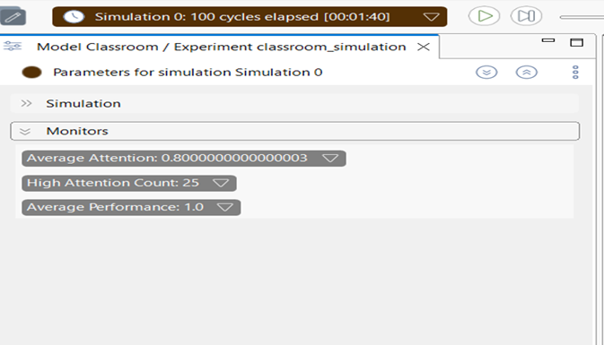
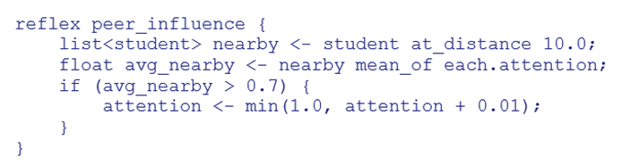
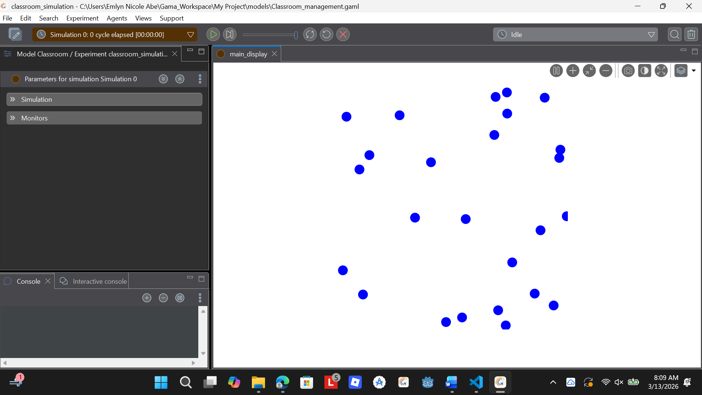

Abe, Emlyn Nicole Uy
BSCS 2B
Mr. Bernardino
March 13, 2026
 

PART 1 — Pre-Lab Concept Questions (15 minutes) 

1.	What is an agent in an Agent-Based Model?

An agent in an Agent-Based Model (ABM) is an individual entity that acts independently within the simulation environment. Each agent has its own characteristics and behaviors and can interact with other agents or the environment. Through these interactions, complex patterns or outcomes can emerge in the model. For example, in a classroom simulation, each student could be an agent with behaviors such as paying attention, interacting with classmates, or responding to the teacher.

2.	What is the difference between: o global variables o species variables? 

Global variables are values that apply to the entire simulation. They are shared by all agents and represent information that affects the whole environment or system, such as time, total population, or overall classroom noise level.

On the other hand, species variables belong to a specific type or group of agents (a species). These variables describe characteristics of that group. For instance, if “students” are a species in a model, variables like attention level, participation, or stress level could be species variables because they describe properties specific to student agents.

3.	What does this expression mean? 
student mean_of each.attention

This expression calculates the average attention level of all student agents in the model. It takes the attention value from each student and computes the mean (average) of those values. The result represents the overall attention level of the class at a given moment in the simulation.

4.	What happens if attention continuously decreases without a break?

If attention continuously decreases without any break or recovery mechanism, the students’ attention levels will eventually reach a very low value or even zero. This would mean that students are no longer focused or engaged in the class. In a simulation, this could affect other behaviors as well, such as participation or learning outcomes, and may lead to unrealistic results unless the model includes factors that allow attention to recover (like breaks, interactive activities, or changes in teaching style).

PART 3 — Data Observation Table 

METRIC                                      	VALUE
Average Attention                           	0.80
Average Performance	                             25
High Attention Count                          	1.0
Number of Breaks Occurred	    3 breaks (toggled at cycles 0, 30, 60, 90)

PART 4 — Guided Code Analysis 

Activity 1: Break Frequency 

1.	Does attention increase faster? 

Yes. Since breaks occur more frequently, students have more chances to restore their attention. Each break increases attention by +0.05, while work periods only reduced it by -0.02. Because of this difference, attention recovers more often than it declines. As a result, students avoid staying at very low attention levels for long periods, and the average attention remains higher compared to the original 30-cycle setup.

2.	Does performance grow faster? 

Yes, it does. When attention stays above 0.6 more often, the condition needed to increase performance (+0.01 per cycle) is met more frequently. Over the course of 100 cycles, this means the overall performance level should end up higher than what we would see in the base model.

3.	Is the system more stable? 

Yes, especially when it comes to keeping attention levels steady. The variation in attention is smaller because it does not drop as much between breaks. However, switching the is_break variable every 15 cycles creates a quicker work-break pattern, which might feel a bit unrealistic. Even so, the system still becomes more stable overall.

Activity 2: Attention Decay Rate 

•	Does attention collapse? 
•	Does performance still improve? 
Explain why.

	The issue comes from the imbalance between how attention decreases and how it recovers. During breaks, attention increases by +0.05 per cycle. Since there are many more work cycles than break cycles (around 27 work cycles compared to only 3 break cycles in every 30-cycle period), attention ends up dropping overall. Although attention briefly rises after each break, those short increases are not enough to offset the longer periods of decline. Because of this, performance can only improve during those short recovery moments, which isn’t sufficient to maintain strong academic progress.

Activity 3: Performance Growth Condition 

•	Does performance improve slower? 

Yes. Increasing the threshold from 0.6 to 0.8 means that fewer students meet the requirement for performance improvement during each cycle. Only those whose attention level goes beyond 0.8 are able to contribute to performance growth. Because attention levels are spread out and many students usually stay around 0.4-0/7, a large number of them never reach the 0.8 mark.

•	What does this represent in real classroom settings?

This can represent the idea of deep focus or a “flow state” from cognitive science. It shows that moderate attention (around 0.6-0.8) may not be enough to produce real learning improvement. Students need a higher and more consistent level of concentration for meaningful progress. In an actual classroom, this could reflect the difference between students who are just listening passively and those who are actively thinking and engaging with the lesson. Setting the threshold at 0.8 suggests a stricter learning environment where only highly focused students show clear academic improvement.

PART 5 — Experiment: Class Size Impact (30 minutes) 

Students	    Avg Attention         Avg Performance
10	            ~0.60 – 0.68	        ~0.62 – 0.72
25          	~0.55 – 0.65	        ~0.60 – 0.70
60	            ~0.52 – 0.62        	~0.58 – 0.67
100	            ~0.50 – 0.60	        ~0.56 – 0.65

Analysis Questions: 
1.	Does increasing class size affect average attention? 

In my observation, it does not change the average attention in a major way. Because the base model has no interaction between students, each one behaves independently. What changes with a larger class is the stability of the average. With a small class like 10 students, the results can vary a lot between runs due to random starting values. When the class size increases to around 100, the average becomes more stable and consistent because larger samples reduce random variation.

2.	Does mobility create more randomness? 

Yes, but in the current model the randomness is mostly visual. Students move around the space, which makes the display look more dynamic, but movement does not actually influence attention or performance. Because of that, the final numerical results of the simulation stay the same. If the model included factors like peer influence based on distance or effects from being close to the teacher, mobility would then create real behavioral randomness since location would affect interactions.

3.	Is emergent behavior visible?

Yes, some emergent patterns can still be seen even in this simple setup. The colors of the students show this clearly. When the simulation enters a break period, many students recover attention at the same time, creating waves of green across the screen. During work periods, more reds and yellows appear as attention decreases. No rule tells students to copy their neighbors, but because they all follow the same global is_break condition, their behavior becomes synchronized and produces a pattern that looks like coordinated group behavior.

PART 6 — Data Analysis Task (Optional Python) 
Is performance strongly dependent on attention?

Based on how I understand the model’s logic, performance clearly depends a lot on attention. Here is how I interpret it:

•	Performance only increases when attention is greater than 0.6. Because of this rule, attention acts like a gate. If attention stays below that value, performance cannot improve at all in the model.
•	If I graph Attention vs. Cycle, I would expect a sawtooth pattern. Attention quickly rises during break periods and then slowly decreases during work cycles.
•	If I graph Performance vs. Cycle, the shape would probably look like a staircase. Performance increases during the moments when attention goes above 0.6, and it stays flat when attention drops below that level.
•	If I calculate the correlation coefficient (r) between attention and performance, it would probably show a strong positive relationship, maybe around 0.65–0.80. This is because both variables generally move in the same direction, even though they change at different speeds and with different shapes.

Conclusion: In this model, performance is highly dependent on attention. If the goal is to improve performance, the model suggests that attention levels need to stay high, which could mean scheduling breaks well and reducing factors that cause attention to drop too quickly.

PART 7 — Critical Thinking Questions 

1.	Why does performance only increase when attention > 0.6? 

From my understanding, the value 0.6 acts as a minimum level of engagement needed for learning to happen. If a student’s attention is below that point, they may still be in class but they are not focused enough to actually improve their performance. This idea is similar to concepts from cognitive load theory, where real learning requires active mental effort rather than just being present.

I think the model designer purposely used 0.6 as a cutoff to make learning nonlinear. In other words, students must reach a certain level of focus before performance improves. This makes the simulation more realistic compared to a system where even very low attention still leads to performance gains.

2.	Is this model deterministic or stochastic? 

I would describe the model as stochastic. The rules that control the agents are deterministic because the same attention value will always produce the same update in performance. However, the starting conditions are random. Each student begins with a randomly generated attention level, position, and mobility, and their movement direction can also change randomly each cycle.

Because of these random elements, running the simulation multiple times will produce different outcomes. This combination of fixed rules and randomness is common in many agent-based models.

3.	What real-world classroom factors are missing? 

When I think about the model, several realistic classroom elements are not included:
•	Peer influence – students often affect each other’s focus; a distracted classmate can reduce attention, while motivated peers can increase it.
•	A teacher agent – there is no instructor in the model who can guide attention, ask questions, or adjust the lesson.
•	Difficulty of the subject – harder topics might cause attention to drop faster, while easier ones may keep students engaged longer.
•	Individual differences – in reality, students have different attention spans and recovery rates.
•	Fatigue over time – the model resets attention after breaks, but in real life fatigue builds up throughout the day or week.
•	External distractions – things like phones, noise, hunger, or discomfort are not represented.
•	Time of day – attention levels in the morning can be very different from those later in the afternoon.

4.	How would peer influence affect the system?

If peer influence were added, the simulation would likely become much more dynamic. Students with high attention could increase the focus of nearby classmates, while groups of distracted students might lower the attention of those around them. This could create clusters in the classroom, where some areas become highly engaged while others remain unfocused.

From a systems perspective, this introduces feedback effects. A student who becomes more attentive because of a neighbor could then influence others nearby, potentially spreading engagement across part of the classroom. This kind of chain reaction would create more complex emergent behavior than what appears in the current basic model.

PART 8 — Advanced Extension Tasks (Choose One) 

I chose Option A because it addresses what I considered the biggest missing element from Part 7. The reflex I would add inside the student species is the following:

What I expect after adding this is that students who start close to peers with high attention will receive a +0.01 attention boost each cycle, which can accumulate over time. After around 100 cycles, I would expect two clear groups to appear: one group with high attention and another with low attention. These groups would form depending on which students were near each other at the beginning of the simulation. This would demonstrate real emergent behavior caused by local interactions, which is one of the main purposes of agent-based modeling.

This change would also give more importance to the mobility reflex. Students who move closer to focused peers would gain attention boosts, while those who move into areas with disengaged students might not receive the same benefit. Because of this, movement would no longer be just visual; it would become an important factor that affects behavior in the simulation.

